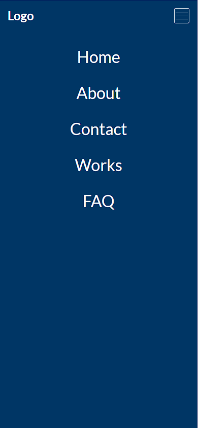

# Accessible Responsive Mobile Navigation Example

- Using a semantic element for the toggle button.
- Using a semantic element for the nav.
- Using aria attributes for the toggle element.
- **Vanilla JS** toggle function.

